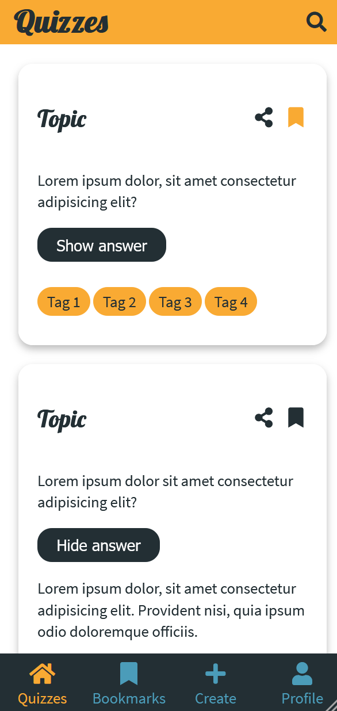
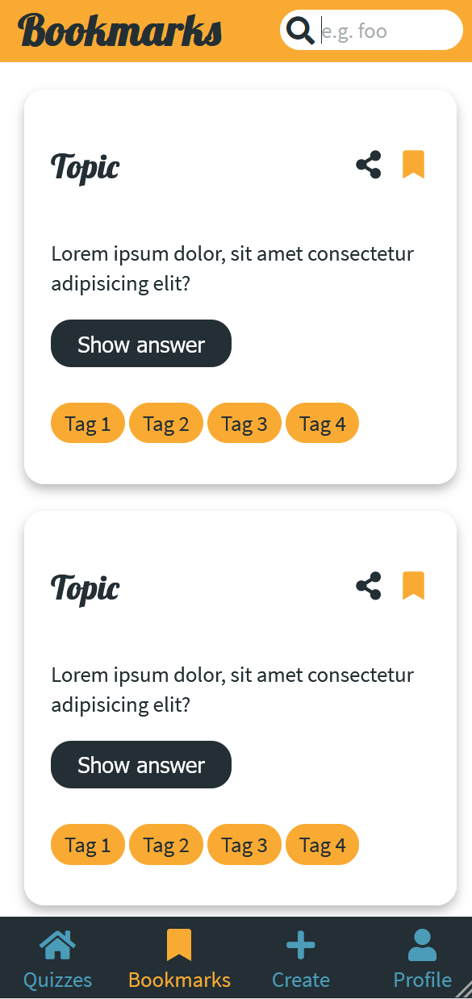
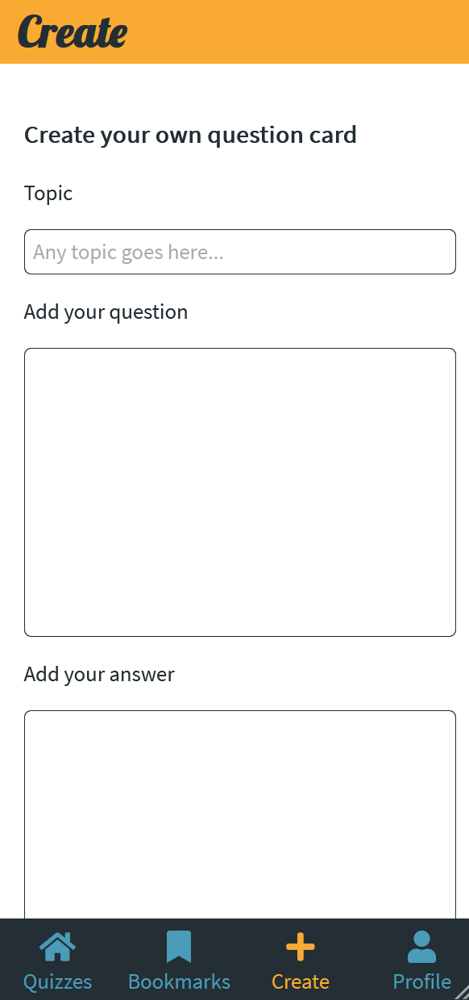
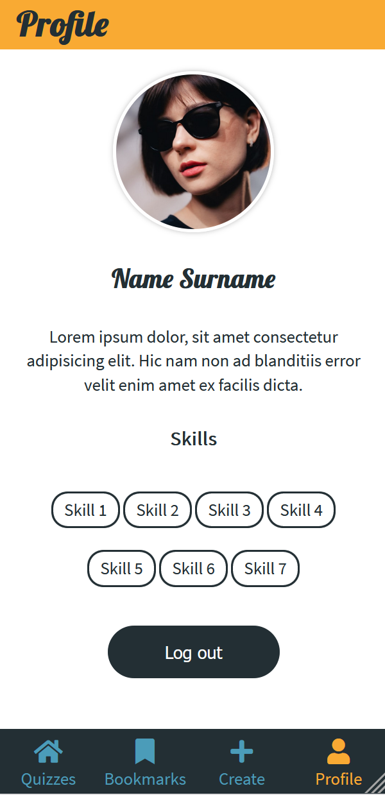

# Quizzes

## Description

Simple static frontend quiz app

## Setup

1. Clone repo
2. Run `npm install` to install dependencies
3. Run `npm start` to start the server and run the app in development mode
4. Run `npm build` to deploy to production

## Tech stack

- HTML
- SCSS
- Parcel

## Impressions

   
